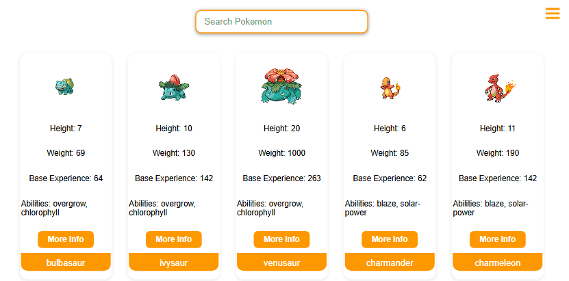
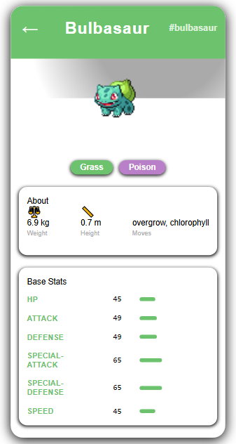
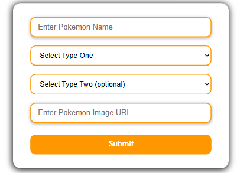

# 🧭 Buscador de Pokémons - React App

Este proyecto es una aplicación web construida con **React** que permite buscar y visualizar información sobre Pokémons utilizando la API pública de [PokeAPI](https://pokeapi.co/).

## 🚀 Características principales

- 🧾 Vista principal con un listado de Pokémons.
- 🔍 Vista detallada de cada Pokémon con información específica.
- 🔄 Consumo de la API de PokéAPI usando **Axios**.
- 🍔 Menú tipo hamburguesa para navegación responsiva.
- 🎨 Estilos personalizados utilizando **SASS**.
- 🆔 Generación de identificadores únicos con **UUID**.
- 📝 Formulario para añadir Pokémons manualmente.
- 📦 Manejo de estado y navegación usando hooks de React.
- 🔗 Comunicación entre componentes mediante **useContext**.

## 🌐 Link de despliegue

Accede al proyecto en línea aquí:  
👉 [https://dulcet-arithmetic-3e7078.netlify.app](https://dulcet-arithmetic-3e7078.netlify.app) 

## 📸 Capturas de pantalla

### 🏠 Vista principal (Listado de Pokémons)

  

### 📄 Vista detallada de un Pokémon

  

### ➕ Formulario para añadir Pokémons

  

## 🧰 Tecnologías y librerías utilizadas

- [React](https://reactjs.org/)
- [Axios](https://axios-http.com/)
- [SASS](https://sass-lang.com/)
- [UUID](https://www.npmjs.com/package/uuid)
- [Debounce](https://www.npmjs.com/package/use-debounce)
- [PokeAPI](https://pokeapi.co/)

## 🧠 React Router y Hooks utilizados

- `useState` (hook)
- `useEffect` (hook)
- `useContext` (hook)
- `useParams` (React Router)
- `useNavigate` (React Router)
- `useLocation` (React Router)
- `BrowserRouter` (React Router)

## 📝 Descripción adicional

- El **formulario** para añadir nuevos Pokémons se comunica con el componente de listado utilizando `useContext`, permitiendo mantener sincronizado el estado global del proyecto.
- Se implementa navegación entre vistas utilizando `react-router-dom`.